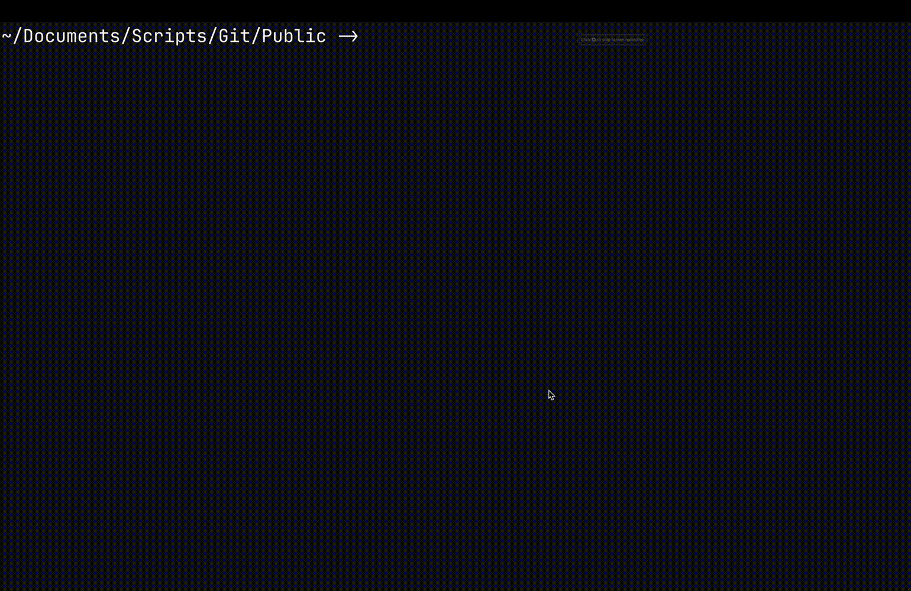

# go-repoflow (Go)
<p align="center">

</p>

A developer-focused CLI that bridges local Git workflows and GitHub automation.

## 🚀 Features

- Find TODO lines in the current folder
- Find open GitHub issues using the configured remote
- Check whether a TODO already exists on GitHub and annotate it when needed
- Visualize commit activity across local git repositories in a terminal calendar view
- Create, list, and increment semantic version tags
- Open the remote repository in your browser for pull requests and issue URLs
- Clone public repositories for a given GitHub user or organization into a temporary workspace
- Scan subdirectories and report repositories with uncommitted or unpushed changes

Demo images:




## 🛠️ Prerequisites

- [Go](https://golang.org/dl/) installed (version 1.16+ recommended)
- A GitHub token with permission to read and edit issues
  - [GitHub documentation](https://docs.github.com/en/authentication/keeping-your-account-and-data-secure/managing-your-personal-access-tokens#creating-a-fine-grained-personal-access-token)

## 📁 Setup

1. Clone this repository:

   ```bash
   git clone https://github.com/jonathon-chew/go-repoflow.git
   cd go-repoflow
   ```

2. Compile the script:


   ```bash
   go build ./...
   ```

3. Install the script:

   ```bash
   go install ./...
   ```

   Or install the command package directly:

   ```bash
   go install github.com/jonathon-chew/go-repoflow/cmd/rf@latest
   ```

## 📂 Output

This creates and manages GitHub issues for TODO lines in your codebase, helping you keep local notes and remote tracking in sync.

## 🧠 Notes

This project is inspired by [snitch](https://github.com/tsoding/snitch).

## 📜 License

This project is licensed under the MIT License. See the LICENSE file for details.

### 🖌️ Attribution

The Go Gopher was originally designed by [Renee French](https://reneefrench.blogspot.com/).  
Used under the [Creative Commons Attribution 4.0 License](https://creativecommons.org/licenses/by/4.0/).  
