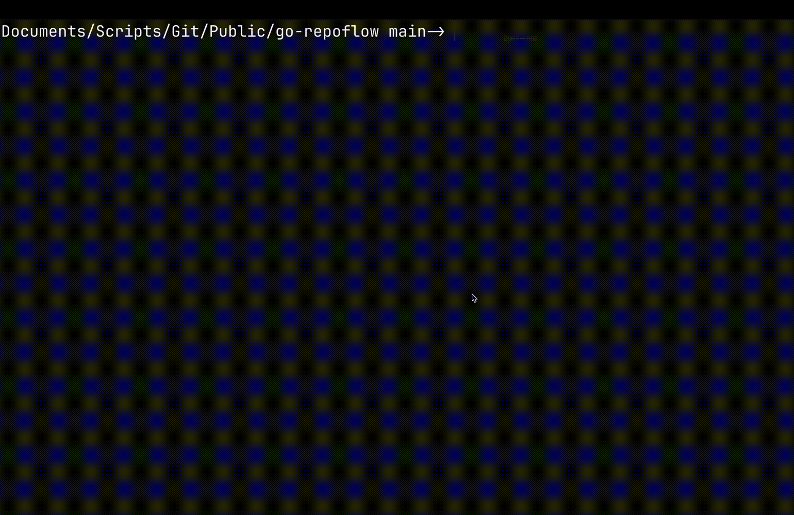

# go-repoflow (Go)
<p align="center">

</p>

A developer-focused CLI that bridges local git workflows and GitHub automation. 

## 🚀 Features

- Finds all the TODO lines in the current folder
- Finds all the open issues in your github - using git remote

- Checks to see whether or not the issue is in github 
    - If it is not on GitHub in will add a issue number to the start of the todo line
    - If it is on GitHub it will ignore the issue 
- Visualize commit activity across all git repositories in subdirectories, aggregated into a single terminal calendar view.

- Tag managment, create, list, and increment semantic version tags with minimal friction.
- Instantly open the remote repository in your browser (GitHub supported) for pull requests and issue URLs.
- Clone all public repositories for a given GitHub user or organization into a temporary workspace.
- Scan all subdirectories (one level deep) and report repositories with uncommitted or unpushed changes.

## 🛠️ Prerequisites

- [Go](https://golang.org/dl/) installed (version 1.16+ recommended)
- A github token for the repository with permission to read / edit issues 
    - [Github Documentation](https://docs.github.com/en/authentication/keeping-your-account-and-data-secure/managing-your-personal-access-tokens#creating-a-fine-grained-personal-access-token)

## 📁 Setup

1. Clone this repository:

   ```bash
   git clone https://github.com/jonathon-chew/go-repoflow.git
   cd go-repoflow 
   ```

2. Compile the script:


   ```bash
    go build ./...
   ```

3. Install the script:

    ```bash
   go install`
   ```

OR

1. Go install

    ```bash
    go install github.com/jonathon-chew/go-repoflow/cmd/rf@latest
    ```

## 📂 Output

This will make Github issues for you automatically and edit your codebase - just the todo line, to save the number of the issue for easily finding which issue is the right issue.

## 🧠 Notes

This is inspired by the project here: https://github.com/tsoding/snitch

## 📜 License

This project is licensed under the MIT License. See the LICENSE file for details.

### 🖌️ Attribution

The Go Gopher was originally designed by [Renee French](https://reneefrench.blogspot.com/).  
Used under the [Creative Commons Attribution 4.0 License](https://creativecommons.org/licenses/by/4.0/).  
